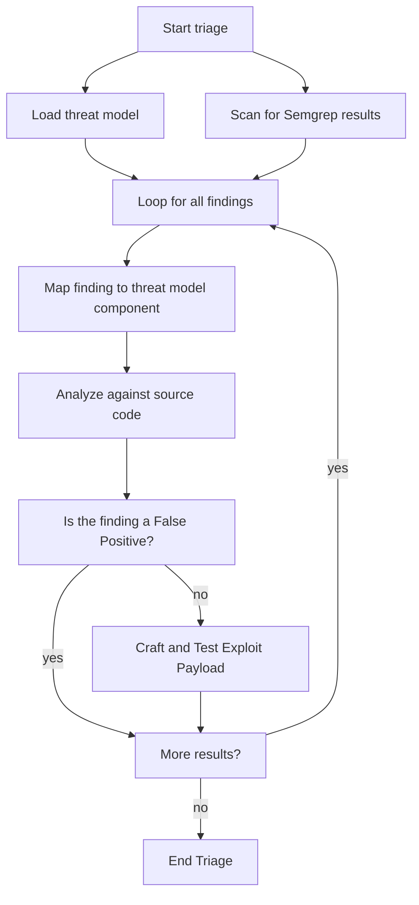
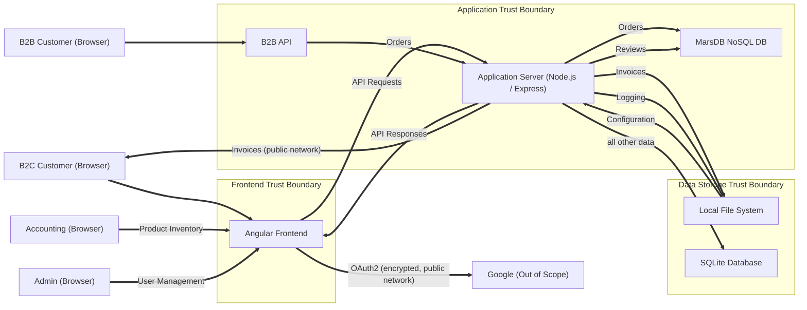

<script type="module">
  import mermaid from '/assets/js/mermaid/mermaid.esm.min.mjs';
  mermaid.initialize({ startOnLoad: true });
  document.querySelectorAll('pre > code.language-mermaid').forEach((codeBlock) => {
    codeBlock.parentElement.outerHTML = `<pre class="mermaid">${codeBlock.textContent}</pre>`;
  });
</script>

My interest in AI workflows was sparked by a talk from Black Hills InfoSec at a B-Sides event in 2026. The speaker distinguished between "agent workflows" and "LLM workflows." The overall argument is that many workflows benefit from the LLM step, not only in terms of cost, scope, and time, but also of cost. It was the first time I had considered this in a Cybersecurity context.

One of the demonstrations involved an n8n workflow that performed triage against a [Prowler](https://github.com/prowler-cloud/prowler) cloud finding. In many ways, this post continues that thinking within an Application Security context. 

The difference between an "LLM workflow" or "AI workflow" is the use of LLM as a step within a tightly controlled, deterministic workflow. An LLM step could also augment the control flow, although if you're thinking along these terms, you might actually be creeping towards an agent. For now, let's just consider a more controlled use case.

IoC analysis is the "hello world" of many Cybersecurity AI workflows. This is great for SOC teams and useful for learners who are new to AI security. For Application Security and Vulnerability Management, our "post-hello-world" is vulnerability triage.

Before we get in the weeds, let's define the preferred scope of this code review:

> Static analysis findings that can be exploited against the web application by a remote attacker.

In a real AppSec capacity, this is unlikely to be sufficient, as it omits secrets, supply chain, and other factors entirely. But it does help us define a model for prioritizing what we *should* start with in order to follow the 20/80 rule (80% of our outputs defined by 20% of our inputs). 

Narrowing static findings to a shortlist of 20% is an ambitious goal for human operators with free tools. To tackle this, we will assume a degree of acceptable cost and leverage an LLM to whittle down the results. If we can keep the cost of an engagement below $1, and emit a shortlist of exploitable findings. I would say the effort was successful.

Static analysis has a huge advantage and a huge downside. The advantage is that you can catch a ton of vulnerabilities in code, especially at commit or merge time, before they ever deploy into the wild. The downside is the volume of context-unaware false positives.

Hybrid analysis approaches can help. Threat models can steer practitioners to identify trust boundaries or design weaknesses that could facilitate exploitation; or, conversely, defenses at those areas which can mitigate issues. Having an awareness of where a code finding sits in the larger application ecosystem is essential to understand how a threat actor will try to weaponize that weakness.

Consider the following workflow, a common approach to static analysis:



Intrinstically, there is no AI at all in this workflow. It is a common approach to static analysis triage, and application scanner triage overall. It's an abstraction of something that good practitioners do all the time.

We could tweak the steps (for example, analyzing only the HIGH results), but this is the general idea. A human at a computer should triage findings and assess the merit of the finding. This step is essential for risk analysis and exploit path analysis.

This assumes you have a threat model, access to Semgrep, and access to a reasonable LLM. To solve these problems, we can clone the OWASP Juice Shop's repository, use it's simplistic threat model (written for the Theat Dragon schema), and install Semgrep's free version.

The Juice Shop is a convenient playground for lots of use cases, including security tool evaluations. Many agentic pentest tools, like KeystoneHQ's Shannon, use it as a benchmark to test the capabilities of AI as an offensive security resource.

If you've never pentested it before, I encourage you to do so before you distill any of the findings here. It's a fun platform, and all of the answers are posted online in case you get frustrated (or if you, you know, want to learn about web application vulnerability testing).

Juice Shop's threat model (without any threats identified) is shown here:



Mermaid doesn't always generate a pretty diagram, so apologies if this looks even more like spaghetti once it's deployed than it does now, while I'm writing this walkthrough.

A Black Hills InfoSec speaker once said that "LLMs *love* JSON." I have generally found this to be true, provided the context window is reasonable. LLMs also love most types of structured output that can be represented in text, such as XML and even Meramid. If they love JSON, then they have a strong working relationship with Mermaid flowcharts.

Copy and save the Mermaid flowchart as `mermaid.flowchart`. The code workflow will consume this.

```
flowchart LR
B2C["B2C Customer (Browser)"]
Google["Google (Out of Scope)"]
B2B["B2B Customer (Browser)"]
Admin["Admin (Browser)"]
Accounting["Accounting (Browser)"]

subgraph FrontendBoundary["Frontend Trust Boundary"]
Angular["Angular Frontend"]
end

subgraph APIBoundary["Application Trust Boundary"]
B2BAPI["B2B API"]
AppServer["Application Server (Node.js / Express)"]
MarsDB["MarsDB NoSQL DB"]
end

subgraph DataBoundary["Data Storage Trust Boundary"]
LocalFS["Local File System"]
SQLite["SQLite Database"]
end

B2C ==> Angular
Angular ==>|"OAuth2 (encrypted, public network)"| Google
Angular ==>|"API Requests"| AppServer
AppServer ==>|"API Responses"| Angular
AppServer ==>|"Invoices"| LocalFS
B2B ==> B2BAPI
B2BAPI ==>|"Orders"| AppServer
Accounting ==>|"Product Inventory"| Angular
Admin ==>|"User Management"| Angular
AppServer ==>|"all other data"| SQLite
AppServer ==>|"Orders"| MarsDB
AppServer ==>|"Reviews"| MarsDB
AppServer ==>|"Invoices (public network)"| B2C
LocalFS ==>|"Configuration"| AppServer
AppServer ==>|"Logging"| LocalFS
```

For this case, we will evaluate how well the Semgrep OSS scan performs against this intentionally-vulnerable application with many well-documented vulnerabilities.

> Note: I call out the "OSS" part because this is Semgrep's cost-free, license-free offering. While it has its shortcomings, the OSS model is a great start for teams that are new to application security and gating. The "pro" features, which include the taint analysis engine, are available to registered users. Licensing options and advanced features, such as AI scans, are also available at a forgiving price compared to competitors' offerings.

Let's run a scan and cache the findings.

```
$ semgrep scan --oss-only --json-output semgrep.json
...

$ jq 'keys[]' semgrep.json
...
"results"
...

$ jq '.results | keys[]' semgrep.json | wc -l
77
```

This scan found 77 findings. This should match an intuition since the Juice Shop is, well, undeniably pwn-able.

Semgrep results are actually very documentation-rich compared to other tools. (For example, they generally include CWEs.) If you're parsing their output JSON for the first time, some key fields include:

- `check_id`: The unique rule ID used to raise the finding
- `path`: The path to the file where a weakness was detected
- `extra.message`: The description of this rule or finding (includes taint analysis results)
- `extra.lines`: The evidence from source code used to raise the finding

Let's look at the first finding:

> **Rule ID**: **yaml.github-actions.security.github-actions-mutable-action-tag.github-actions-mutable-action-tag**
>
> **Description**: GitHub Actions step uses a mutable tag or branch reference. Tags and branch names can be silently repointed by the action owner, enabling supply-chain attacks — as seen in the trivy-action and kics-github-action compromises. Pin the reference to a full 40-character commit SHA instead, e.g. `uses: actions/checkout@8ade135a41bc03ea155e62e844d188df1ea18608`.
>
> **Evidence**: `        uses: coverallsapp/github-action@v2` (the leading spaces are from code and intentional here)

This is generally the gist. You'll want to go through findings, usually one-by-one, starting from higher to lower severity, and determine:

- Where scanner made a clearly invalid judgement call (false positive)
- Which results are exploitable today (and if so, what is the risk?)
- Which results could be exploitable given reasonable conditions (and, if so, what conditions are required?)

Notice that I'm referring to the outputs of the scan as "findings" or "results." I am not yet calling these *vulnerabilities.* Following MITRE's anatomy of a vulnerability, we would need to determine three major parts:

- Root cause
- Impacts
- Preconditions

Semgrep's results provide CWE IDs for root cause analysis, so that part is done. While impacts can be inferred from the results, it's ambiguous to say what impact they have *with respect to the system* until you actually try it. Even then, you could say that the impact analysis is "good enough" given most of the context.

It's the preconditions that give us pause. 

In code, a factor of exploit likelihood is the concept of *reachability.* Good scanners, like Semgrep's Pro engine and Github's CodeQL, will convert code into its abstract syntax tree (AST) format, then "query" or traverse the AST to determine if there exists a reachable path from the application's entrypoints or code logic to the vulnerable logic. In theory, this is a cool idea.

In practice, this is actually a huge pain. It gets worse in especially large codebases, full of spaghetti code, or collections of first-party code that are consumed by production apps as dependencies. Not only will scanners struggle to analyze with rigor, but human operators likely will as well. 

As it turns out, code agents and flagship models do a pretty good job at reachability, provided an appropriate amount of inputs. We will explore how they fit in with our workflow shortly.

Before we start, I'll call out some advice from vulnerability research methodologies:

1. Try to find an insecure pattern in code (or, even, a suspicious one from manual review)
2. Analyze the content of the finding to determine if the scanner reported on a poor finding. If so, note it and move on.
3. Perform reachability exercises to determine if there exists a source from untrusted input (across trust boundaries; remember the threat model) to the sink (the vulnerable logic).
4. Try to exploit the vulnerability in the runtime application.

Step 1 is covered by Semgrep. Step 4 outside of this walkthrough's scope, although Offensive AI agents and frameworks are developed more and more nowadays, so you can try this on your own. Step 3 will be covered briefly, but not really in the same amount of depth; I've found that AI agents or agent-driven workflow steps offer better reachability verdicts, and can even perform well enough with deep analysis into long chains of transitive dependencies, and all of that is a different conversation entirely.

Instead, we will leverage a humble workflow script to help with false positive analysis. 

Why? False positive analysis in code is usually one of the most exhausting stages of security reviews, and it consumes valuable time that should be invested in better findings. it gives us the most cost-effective way to begin a *real* code review or vulnerability research exercise. 

From the previous triage workflow, we will outsource the following:

- The LLM will tell us which application components (from the threat model) are affected by the vulnerability. This will help us determine the *contextual* exploit likelihood and help us plan real exploits based on the system's deployment model.
- The LLM will then compare the finding with the source code and determine the false positive status. It then describes the exploit scenario as it sees it. We want this context for true positives and false positives to determine if the LLM was on the nose or if it hallucinated; the LLM is an assistant, but you are the authority.

Our approach is a bit cavalier. Providing too much context at once can become an expensive activity and can overflow the context window if you're not careful. In the real world, you'll probably want an AST step that fetches the function's code or control flow before doing this. 

But the Juice Shop's code is more humble than real examples, so it's a good candidate for a toy workflow.

One final note: I am not using any kind of workflow-centric Python library or runner. These do exist, but they're not covered here. For a low-code solution, you could port the approach as an n8n workflow, which is also not covered here.

## Analyzing the Attack Surface

Here's how we set up the problem:

```python
import instructor
from dotenv import load_dotenv
from pydantic import BaseModel, Field
import json
from pathlib import Path

load_dotenv()

client = instructor.from_provider(
    "openai/gpt-4o", mode=instructor.Mode.RESPONSES_TOOLS
)


class VulnResult(BaseModel):
    provider_vuln_id: str = Field(
        description="The provider's ID for the vulnerabiliy or scan rule",
        default="NONE",
    )
    affected_file: str = Field(description="The path to the affected source file")
    explotable_from_network: bool = Field(
        description="Is the vulnerability exploitable from the web?"
    )
    exploitable_from_leak: bool = Field(
        description="Is the vulnerability exploitable from a source code leak?"
    )


class ComponentVulns(BaseModel):
    name: str = Field(description="The name of the component")
    results: list[VulnResult] = Field(
        description="All vulnerabilities that map to this component"
    )


class Assessment(BaseModel):
    results: list[ComponentVulns]
```

I'm starting with `gpt-4o`, an older model, specifically because it better aligns with the `gpt-oss` models. It's a good litmus test for whether your solution is likely to run well on a home lab with affordable hardware, like an RTX 3090.

The schema models will provide us more of an "attack surface" view of where each vulnerability fits. This is not exclusively used for false positive analysis, but it is incredibly useful for understanding why a false positive may exist.

Next, load our static files and perform the attack surface analysis:

```python
with open("semgrep.json") as f:
    vulns = json.load(f)["results"]


# Get the path names of all affected files.
paths = list(set([r.get("path") for r in vulns]))

print(paths)

assessment = client.create(
    response_model=Assessment,
    temperature=0.3,
    messages=[
        {
            "role": "system",
            "content": (
                "You are a helpful vulnerability triage expert.\n\n"
                "Analyze the <systemDiagram> and explain which system components "
                "contain the <vulns>.\n\n"
                "If a component is not represented in <systemDiagram>, ignore any results "
                "that relate to it."
            ),
        },
        {
            "role": "user",
            "content": (
                f"<systemDiagram>\n{diagram}\n</systemDiagram>"
                f"<vulns>\n{json.dumps(vulns)}\n</vulns>\n\n"
                "Assessment:"
            ),
        },
    ],
)

results = json.loads(assessment.model_dump_json())

print(json.dumps(results, indent=2))
```

Our objective with this analysis step is to determine which weaknesses are exploitable by a remote attacker and which ones might be exploitable via a leak. In a way, we are developing features of a graph. The use of booleans for key node features support this exercise.

You can also determine other features, such as `exploitable_in_ci` for issues that affect IaC or runners. You could also filter the results to weed-out any known rules or heuristics that meet other conditions for defense-in-depth analysis. 

For now, our cavalier approach is fine.

We provide the model with the Mermaid flowchart representing the threat model, and the path names for any files where a finding was raised. Limiting the Semgrep input only to the pathnames is a technique to address the problem without overflowing the context window. This is an appropriate filter to help answer the question, "Where does this vulnerability exist?" and "How is it reachable with respect to the system design?"

In the real world, you would want to compare this with any IaC to provide a little more rigor. But the Juice Shop assumes a simple deployment model, which makes it convenient for a proof of concept.

The system and user prompts both use pseudo-tags like `<systemDiagram>` and `<vulns>` to separate elements within the context window. These are not always necessary, but LLMs tend to perform better when you provide context in a structured manner.

> Note: Expanded, indented JSON in the context window is something that has given me mixed results. Sometimes it works better, and sometimes it doesn't. 

A final observation is that we're using a really ugly approach to the prompts. You can streamline this by using Instructor's `context` option with a Jinja template. It's optional, but it accomplishes the same thing, and is much easier to read.

This gives us results like:

```json
{
  "results": [
    {
      "name": "Angular Frontend",
      "results": [
        {
          "provider_vuln_id": "package_managers.npm.npm-missing-minimum-release-age.npm-missing-minimum-release-age",
          "affected_file": "frontend/.npmrc",
          "explotable_from_network": false,
          "exploitable_from_leak": true
        },
        {
          "provider_vuln_id": "generic.secrets.security.detected-jwt-token.detected-jwt-token",
          "affected_file": "frontend/src/app/app.guard.spec.ts",
          "explotable_from_network": false,
          "exploitable_from_leak": true
        },
        ...
```

For open-source projects, this is obviously bad news. But if your projects are gated, this is basically a good thing to know. The most likely compromise is source-code disclosure; during false-positive analysis, you will factor those in, but we aren't there yet.

Now let's peek at some of the Application Server findings:

```json
    {
      "name": "Application Server (Node.js / Express)",
      "results": [
        {
          "provider_vuln_id": "javascript.express.db.sequelize-express.sequelize-express",
          "affected_file": "data/static/codefixes/dbSchemaChallenge_1.ts",
          "explotable_from_network": true,
          "exploitable_from_leak": true
        },
        {
          "provider_vuln_id": "javascript.sequelize.security.audit.sequelize-injection-express.express-sequelize-injection",
          "affected_file": "data/static/codefixes/dbSchemaChallenge_1.ts",
          "explotable_from_network": true,
          "exploitable_from_leak": true
        },
        {
          "provider_vuln_id": "javascript.express.db.sequelize-express.sequelize-express",
          "affected_file": "data/static/codefixes/dbSchemaChallenge_3.ts",
          "explotable_from_network": true,
          "exploitable_from_leak": true
        },
        ...
```

It may have been a bit premature to request an `exploitable_from_leak` condition since, technically, a source code leak could quickly become a weaponized compromise. We will ignore this flag for the time being because it registers in other findings in a way that says, "duh." For evaluating our solution, this is good to note, and we would probably remove it in order to save tokens.

We also made a classic rookie move: including folders that are not part of the runtime! The Juice Shop's `data/static/codefixes` folder includes content for a kind of "best fix" minigame. In a real engagement, depending on your scope, you would likely want to omit content that does not explicitly propogate into the runtime; you can use Semgep's `exclude` options or filter-out paths that contain the omitted path patterns.

Security practitioners tend to take a breadth-first approach to findings. This is not a bad thing, but we have to be mindful of the context window and token burn. Define your scope and narrow down exaclty what you need.

A useful Node-friendly way to do this is with Madge, a CLI tool that emits a graph of file dependencies (which files import other files) for your first-party code, and an optional shallow fetch of direct dependencies. This is useful when you want to define what exactly your application will use when it's booted up or compiled.

```
$ npx madge --json server.ts
...
  "server.ts": [
    "data/datacreator.ts",
    "data/static/locales.json",
    "lib/antiCheat.ts",
    "lib/insecurity.ts",
    "lib/logger.ts",
    ...
```

For now, we will naively continue with our simplistic approach. But if you're serious about this kind of thing, define your code scope, and enforce it in your own analysis.

Here's a snippet from the "Application Server" array that I would consider more "workable:"

````json
        {
          "provider_vuln_id": "javascript.sequelize.security.audit.sequelize-injection-express.express-sequelize-injection",
          "affected_file": "routes/login.ts",
          "explotable_from_network": true,
          "exploitable_from_leak": true
        },
        {
          "provider_vuln_id": "javascript.express.db.sequelize-express.sequelize-express",
          "affected_file": "routes/search.ts",
          "explotable_from_network": true,
          "exploitable_from_leak": true
        },
        {
          "provider_vuln_id": "javascript.sequelize.security.audit.sequelize-injection-express.express-sequelize-injection",
          "affected_file": "routes/search.ts",
          "explotable_from_network": true,
          "exploitable_from_leak": true
        },
````

Express routes are clear entrypoints into the application's business logic. The Juice Shop conveniently doesn't add too much complexity with this mapping. Cloud native solutions, like AWS Lambda Functions or Azure Functions, also offer a convenient, often predictable entrypoint convention.

A final note for this step in the workflow: nothing is stopping you from sending the vulnerability list in one or more rounds. Sometimes, this is a convenience that helps the LLM make high-quality judgements; and other times, it is necessary to avoid context window overflow. A simple for-loop of one-shot LLM calls will usually suffice.

## False Positive Analysis

The time-saving step here is false positive analysis. I'm going to start with a *clear* example of a false positive before we make our way into more complex cases. This will help to demonstrate what a real vulnerability researcher would table straightaway versus what they might want to follow in depth.

Consider this finding from the results:

- **Check ID**: `javascript.express.security.audit.xss.pug.explicit-unescape.template-explicit-unescape`
- **Description**: Detected an explicit unescape in a Pug template, using either '!=' or '!{...}'. If external data can reach these locations, your application is exposed to a cross-site scripting (XSS) vulnerability. If you must do this, ensure no external data can reach this location.
- **Root Cause**: CWE-79: Improper Neutralization of Input During Web Page Generation ('Cross-site Scripting')
- **Evidence**: `if (splitted.length != 2) {`

[Pug](https://pugjs.org/api/getting-started.html) is an HTML templating engine for Node applications. I say this as though I didn't just Google it for this writeup; but bits of research are necessary for understanding the problem.

Something that isn't clear at all from this finding is the relationship between Server-Side Template Injection (SSTI) and Cross-site Scripting (XSS). Often, an SSTI weakness can lead to arbitrary script execution. 

You can [research other writeups on the topic and how they relate to Pug specifically](https://www.hackingloops.com/ssti-in-pug/), but the intuition with SSTI is to craft a JavaScript payload in the template engine's variable syntax and see if the value changes. A common payload is `7*7`, which would render to `49` if SSTI is exploitable. In Pug, we would use something like `#{7*7}`.

Something that should stand out immediately is the assertion that the JavaScript evaluation `splitted.length != 2` would enable such a condition. In short, it doesn't. There's no injection vector.

> I'll build on that by saying that if the Node runtime can be hijacked, then our assumption that the array's `length` operator will be broken. Browser exploitation is a different rabbit hole and won't be covered here. If you want to learn more, Ret2 Systems has an entire course on the topic.

This is a common pitfall of rule-based scanners. Good practitioners can safely infer this and move on. But the *volume* of findings like this make it a pain, and this is where LLMs can show some value.

We stage the analysis like such:

```python
class ExploitScenario(BaseModel):
    exploitable: bool = Field(description="Is the vulnerability actually exploitable?")
    exploit_scenario: str = Field(
        description="Describe and propose a payload that will exploit the vulnerability"
    )
```

Our false positive engine will give us a simple boolean and explain its thinking. To save on tokens, we could define the exploit scenario as an `Optional[str]`, but we'll keep it to maintain a consistent schema.

Next, let's focus just on this finding from our loaded Semgrep result collection. This result is the only one of its kind, so the first result is what we want:

```python
pugs = [
    r
    for r in vulns
    if r.get("check_id")
    == "javascript.express.security.audit.xss.pug.explicit-unescape.template-explicit-unescape"
][0]

pug_result = {}
pug_result["check_id"] = pugs.get("check_id")
pug_result["title"] = pugs["extra"]["message"]
pug_result["evidence"] = pugs["extra"]["lines"]

with open(Path('juice-shop') / pugs["path"]) as f:
    pug_content = f.read()
```

This trims down the finding to its most essential components. Additionally, this analysis will compare the finding against the entire source code. I reiterate that this approach is naive and will overflow the context window if you're not careful; but I already proved that it works, so we will continue for now.

Now, we stage the call and analyze the results:

```python
exploit_scenario, completion = client.create_with_completion(
    response_model=ExploitScenario,
    model="gpt-5.6-sol",
    messages=[
        {
            "role": "system",
            "content": (
                "You are a useful vulnerability triage expert.\n\n"
                "Analyze the <vulnerabilityFinding> against its <sourceCode>. "
                "Focus on how the 'evidence' aligns with the control flow, calls, etc.\n"
                "Then, propose an exploit verdict. "
                "If the vulnerability is exploitable, describe an exploit. "
            ),
        },
        {
            "role": "user",
            "content": (
                "<vulnerabilityFinding>\n"
                f"{json.dumps(pug_result)}\n"
                "</vulnerabilityFinding>\n"
                "<sourceCode>\n"
                f"{pug_content}\n"
                "</sourceCode>\n\n"
                "Exploitation results:"
            )
        }
    ],
)
```

As a proof of merit, I use the `gpt-5.6-sol` model. At the time of writing, this is their newest flagship model and is catered to Cybersecurity processing. It is also very expensive.

Here were its results:

- **Exploitable**: False 
- **Exploit Scenario**: The reported evidence is a JavaScript inequality comparison (`splitted.length != 2`) inside a Pug literal script block. It is not Pug's unescaped-output operator and does not render attacker-controlled data into HTML, so no XSS payload can exploit this finding as reported.
- **Input Cost**: 0.01384
- **Output Cost**: 0.00251999...
- **Cost for 100k rounds**: $1,635

The input and output cost was less than a penny. This all adds up at $10/mil input and $30/mil output tokens. 

But it's good enough to confirm that the LLM is on the right track. It confirmed our own verdict on the problem.

Out of sheer curiosity, we should stop and wonder what the "minimum viable product" is. Let's try the same solution with  `gpt-5.6-luna`:

- **Exploitable**: False
- **Exploit Scenario**: The reported evidence is the JavaScript comparison `splitted.length != 2`, not a Pug explicit-unescape expression. It is ordinary JavaScript inequality inside a `script.` block and does not render or inject external data. No XSS payload can be derived from this finding; the scanner appears to have misidentified `!=` as the Pug unescaped-output operator.
- **Input Cost**: 0.001384
- **Output Cost**: 0.000618
- **Cost for 100k rounds**: $200.20

For our worst-case, input-greedy assessment, Luna is clearly the winner. It gave us an equivalent answer at a far lower rate. In both scenarios, we could have saved even more money by pruning down the source code to include only known paths to the sink. Finally, tools that provide you with complex AST chains as evidence may be well-suited as inputs with minimal pruning steps; examples include CodeQL, Checkmarx SAST, and Semgrep's Pro version.

Another corner case to keep in mind is the model's own belief in the finding's risk. Many providers will reject queries that seem risky. For example, some of the hardcoded secrets return the following:

> Error code: 400 - {'error': {'message': 'This content was flagged for possible cybersecurity risk. If this seems wrong, try rephrasing your request. To get authorized for security work, join the Trusted Access for Cyber program: https://chatgpt.com/cyber', 'type': 'invalid_request', 'param': None, 'code': 'cyber_policy'}}

You will have to decide how to handle these.

Finally, let's generalize the logic, filter for relevant paths, filter *out* strings that may raise the security alert, and see how much it costs:

```python
# npx madge server.ts | grep -v '^  .*' | sort | uniq > madge.txt
# npx madge --ts-config frontend/src/tsconfig.app.json --basedir $(pwd) frontend/src/main.ts | \
#   grep -v '^  ' | sort | uniq >> madge.txt
scope = Path("madge.txt").read_text().split("\n")

input_tokens = 0.0
output_tokens = 0.0

success = 0
failure = 0

evaluation = []

priority = []

for i, result in enumerate(vulns):

    path = result.get("path")
    severity = result["extra"]["severity"].lower()

    pruned = {}
    pruned["check_id"] = result.get("check_id")
    pruned["title"] = result["extra"]["message"]
    pruned["evidence"] = result["extra"]["lines"]

    if (
        not path in scope
        or "secrets" in pruned["check_id"]
        or "hardcoded" in pruned["check_id"]
    ):
        continue

    with open(Path("juice-shop") / result["path"]) as f:
        content = f.read()

    print(f"\n\n==[ Finding #{i} ]==\n")
    print(f"{pruned['title']} ({pruned['check_id']})\n")
    print(f"In `{path}`")
    print(f"```\n{pruned['evidence']}\n```\n\n")

    try:
        analysis, completion = client.create_with_completion(
            response_model=ExploitScenario,
            model="gpt-5.6-luna",
            messages=[
                {
                    "role": "system",
                    "content": (
                        "You are a useful vulnerability triage expert.\n\n"
                        "Analyze the <vulnerabilityFinding> against its <sourceCode>. "
                        "Focus on how the 'evidence' aligns with the control flow, calls, etc.\n"
                        "Then, propose an exploit verdict. "
                        "If the vulnerability is exploitable, describe an exploit. "
                    ),
                },
                {
                    "role": "user",
                    "content": (
                        "<vulnerabilityFinding>\n"
                        f"{json.dumps(pruned)}\n"
                        "</vulnerabilityFinding>\n"
                        "<sourceCode>\n"
                        f"{content}\n"
                        "</sourceCode>\n\n"
                        "Exploitation results:"
                    ),
                },
            ],
        )
        success += 1

    except Exception as e:
        print(e)
        failure += 1
        continue

    if severity == "critical" or severity == "high":
        priority.append(pruned)

    print(f"Exploitable? {'Yes' if analysis.exploitable else 'No'}")
    print(f"Rationale: {analysis.exploit_scenario}")

    evaluation.append(analysis.exploitable)

    input_tokens += completion.usage.input_tokens
    output_tokens += completion.usage.output_tokens

true_pos = len([r for r in evaluation if r == True])
false_pos = len([r for r in evaluation if r == False])
tp_rate = true_pos / (true_pos + false_pos)
fp_rate = false_pos / (true_pos + false_pos)

print()
print(f"True Positive Count: {true_pos}")
print(f"True Positives Rate: {tp_rate}")
print(f"False Positives Rate: {fp_rate}")
print()
print(f"Input Cost: {(input_tokens/1_000_000) * 10.00}")
print(f"Output Cost: {(output_tokens/1_000_000) * 30.00}")
print()
print(f"Priority findings: {len(priority)}/{true_pos} ({len(priority)/len(vulns):.2f}%)")
```

Here, I'm using `gpt-5.6-sol` because the price for the task is reasonable, and because I don't mind putting a little bit more upfront to prove that the approach has merit. The sampled findings we ran ad-hoc earlier were fine, but *all* valid findings may struggle with lighter models. That said, as development continues, you should fine-tune the workflow to avoid relying on a brittle one.

The bill:

```
True Positive Count: 27
True Positives Rate: 0.7297297297297297
False Positives Rate: 0.2702702702702703

Input Cost: 0.7174800000000001
Output Cost: 0.27204

Priority findings: 12/27 (0.16%)
```

The bottom line for this highly-catered run is barely over a dollar.

We have narrowed down our short-list to about 16% of the original report, which follows the 20/80 rule and is generally a Good ThingTM. Of our initial findings, 22/77 or 28% of findings are worth investigating *first*. Of that subset, about 12 findings are considered priority based on this evaluation plus the rule's prescribed severity. 

Again, we want to challenge the LLM's evaluation and make our own judgement at some point. But this shortlist is far more workable as a prioritization model. What it says is, "I can start reviewing these 12 findings first, and given my scope, I am more likely to get high value results compared to the others."

The full output yields more promising leads:

- **Description**: Directory listing/indexing is enabled, which may lead to disclosure of sensitive directories and files. It is recommended to disable directory listing unless it is a public resource. If you need directory listing, ensure that sensitive files are inaccessible when querying the resource. (`javascript.express.security.audit.express-check-directory-listing.express-check-directory-listing`)
- **Path**:  `server.ts`
- **Evidence**: `app.use('/support/logs', serveIndexMiddleware, serveIndex('logs', { icons: true, view: 'details' })) // vuln-code-snippet vuln-line accessLogDisclosureChallenge`
- **Exploitable?** Yes
- **Rationale**: An unauthenticated remote attacker sends `GET /support/logs/` (for example, `curl -i http://TARGET/support/logs/`). Express matches the prefix-mounted middleware in registration order: `serveIndexMiddleware` modifies generated links, then `serveIndex('logs', { icons: true, view: 'details' }) `enumerates the server's logs directory and normally completes the response. Because no authentication or authorization middleware precedes this route, filenames and metadata are disclosed publicly. The attacker can then request a listed file with `GET /support/logs/<listed-log-name>` (for example, `/support/logs/access.log.2026-03-23`); if `serveLogFiles()` permits it, the access log contents are returned, potentially exposing requested URLs, query parameters, client addresses, user agents, and other logged data. The later `verify.accessControlChallenges()` middleware is challenge bookkeeping, not an access-control barrier, and for successful directory-index responses it may not run because serve-index ends the response.

As it so happens, the LLM's `curl` command works (update the target hostname), and system logs are indeed returned to the user. Try it yourself! https://preview.owasp-juice.shop/support/logs

I'm presenting these findings as though were were analyzing a bespoke application. In truth, all Juice Shop exploits are documented on the project's site. As a final model evaluation or training step, we could use those results as inputs to see what Semgrep Free *and* the LLM missed; or, write an agent to find those results inductively. This is left as an exercise.

Also, and I cannot reiterate this enough, this is still something of a toy solution. This kind of approach is being used by practitioners to win simple challenges in CTFs (with chatbots or local agents). It's good to highlight the overall approach. All of the call-outs for reducing context and cost are essential; at some point, you're overspending on low-quality findings.

> Speaking of CTFs, unless you're dry-running a novel LLM or agentic solution, do yourself a favor and limit or omit your use of these AI systems, especially local agents. CTF challenges are learning opportunities. You're doing yourself a huge disservice by avoiding the learning (and, frankly, the demonstration of your value) by asking someone else to do your work. 
>
> If you want to practice an agentic approach to pentesting, reverse engineering, or whatever else, try to save the challenges to your computer, and revisit them with your preferred AI approach. Do this after you've made a real effort to do the work yourself. CTFs are unrealistically simple, with niche solutions, and that's the point. Put your AI work to the real test in a real environment.

Another, less-obvious caveat is that this approach takes time. My runtimes were about six-to-ten minutes, and this was with a heavily filtered list as inputs. The LLM steps, the network RTT and thinking, take awhile and add latency to the workflow. This solution is fine for an ad-hoc engagement, but is probably unacceptable as a CI gate. 

This is where paying for an agile tool, like Semgrep's paid offerings, will offer an advantage for DevSecOps. Never needlessly replace deterministic steps with nondeterministic ones just because it's the zeitgeist today. A hybrid approach might leverage an LLM step to review "blocker" findings from merge requests; but the logic that emits the blocker need not always be AI-driven.

The solution was simple and the approach naive. But the big idea is this: workflows like these can save you time. Pruning them down to match your intuition is where your expertise will shine.

